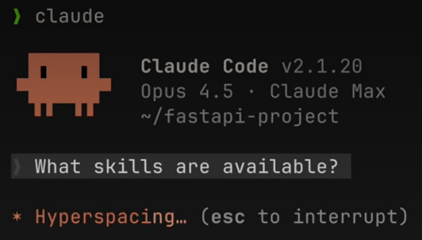
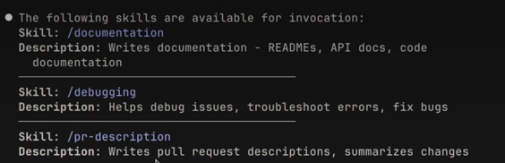
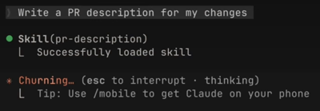
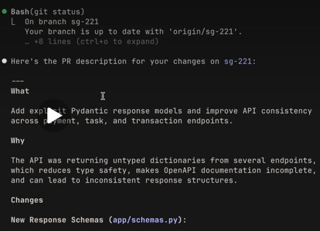

# Creating your first skill

## What you'll learn

By the end of this lesson you'll be able to:

- Create a skill from scratch with proper frontmatter structure  
- Test and verify that a skill loads correctly in Claude Code  
- Explain how Claude Code matches incoming requests to available skills  
- Describe the skill priority hierarchy (Enterprise, Personal, Project, Plugins)  

---

Lets build a skill from scratch — a personal PR description skill that works across all your projects. 
You'll see exactly how to structure the `SKILL.md` file, test it, and understand how Claude Code discovers and matches skills to your requests. 
We'll also cover the priority hierarchy that determines which skill wins when names conflict.

---

## Key takeaways

- A skill is a directory containing a `SKILL.md` file with metadata (name, description) in frontmatter and instructions below  
- Claude loads only skill names and descriptions at startup, then matches incoming requests against those descriptions using semantic matching  
- You get a confirmation prompt before Claude loads the full skill content into context  
- Priority for name conflicts: **Enterprise → Personal → Project → Plugins**  
- To update a skill, edit its `SKILL.md`. To remove one, delete its directory. Always restart Claude Code for changes to take effect  

---

## Creating a Skill

We'll build a personal skill that teaches Claude how to write PR descriptions in a consistent format. Since it's a personal skill, it lives in your home directory and works across all your projects.

First, create a directory for your skill inside the skills folder. The directory name should match your skill name:

```bash
mkdir -p ~/.claude/skills/pr-description
````

Then create a `SKILL.md` file inside that directory. The file has two parts separated by frontmatter dashes:

```md
---
name: pr-description
description: Writes pull request descriptions. Use when creating a PR, writing a PR, or when the user asks to summarize changes for a pull request.
---

When writing a PR description:

1. Run `git diff main...HEAD` to see all changes on this branch  
2. Write a description following this format:

## What
One sentence explaining what this PR does.

## Why
Brief context on why this change is needed

## Changes
- Bullet points of specific changes made
- Group related changes together
- Mention any files deleted or renamed

## Testing
How to verify this works. Include specific commands if relevant.

Keep descriptions concise. Focus on what a reviewer needs to know.
```

The name identifies your skill. The description tells Claude when to use it — this is the matching criteria. Everything after the second set of dashes is the instructions Claude follows when the skill is activated.

---

## Testing Your Skill

Claude Code loads skills at startup, so restart your session after creating one. You can verify it's available by checking the available skills list.



You should see your skill listed. 



To test it, make some changes on a branch and say something like:

> "write a PR description for my changes."



Claude will indicate it's using the PR description skill, check your diff, and write a description following your template — same format every time.



---

## How Skill Matching Works

When Claude Code starts, it scans four locations for skills but only loads the **name and description** — not the full content. This is an important detail.

When you send a request, Claude compares your message against the descriptions of all available skills. For example:

> "explain what this function does"

would match a skill described as:

> "explain code with visual diagrams"

because the intent overlaps.

Once a match is found, Claude asks you to confirm loading the skill. This confirmation step keeps you aware of what context Claude is pulling in. After you confirm, Claude reads the complete `SKILL.md` file and follows its instructions.

---

## Skill Priority

If you clone a repository that has a skill with the same name as one of your personal skills, which one wins? There's a clear priority order:

1. **Enterprise** — `managed-settings.json`, highest priority
2. **Personal** — your home directory (`~/.claude/skills`)
3. **Project** — the `.claude/skills` directory inside a repository
4. **Plugins** — installed plugins, lowest priority (`project/.claude-plugin/plugin.json`)

This lets organizations enforce standards through enterprise skills while still allowing individual customization.

If your company has an enterprise `"code-review"` skill and you create a personal `"code-review"` skill with the same name, the enterprise version takes precedence.

To avoid conflicts, use descriptive names. Instead of just `"review"`, use something like `"frontend-review"` or `"backend-review"`.

---

## Updating and Removing Skills

* To update a skill, edit its `SKILL.md` file
* To remove one, delete its directory
* Restart Claude Code after any changes for them to take effect

---