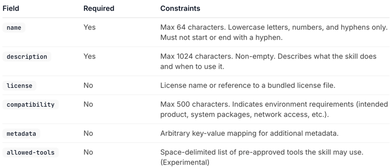
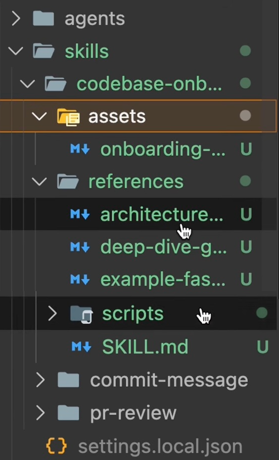
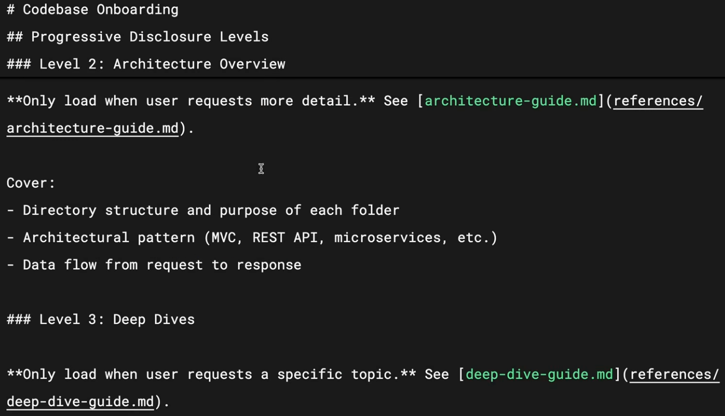

# Lesson Outcome

By the end of this lesson you'll be able to:

- Configure advanced skill metadata fields including `allowed-tools` and `model`
- Write effective skill descriptions that reliably trigger on the right requests
- Use `allowed-tools` to restrict what Claude can do when a skill is active
- Organize complex skills using progressive disclosure and multi-file structures

---

# Configuration and Multi-file Skills

We'll cover the advanced techniques that make skills more powerful: 
the full set of metadata fields, 
how to write descriptions that trigger reliably, 
restricting tool access for security-sensitive workflows, 
and organizing larger skills across multiple files using progressive disclosure.

---

# Key Takeaways

- `name` and `description` are required — `allowed-tools` and `model` are optional but powerful additions  
- A good description answers two questions:  
  - What does the skill do?  
  - When should Claude use it?  
- `allowed-tools` restricts which tools Claude can use when the skill is active — useful for read-only or security-sensitive workflows  
- Progressive disclosure: keep `SKILL.md` under 500 lines and link to supporting files (references, scripts, assets) that Claude reads only when needed  
- Scripts execute without loading their contents into context — only the output consumes tokens, keeping context efficient  

---

# Skill Metadata Fields

The agent skills open standard supports several fields in the `SKILL.md` frontmatter.

## Required Fields

- `name` — Identifies your skill  
  - Use lowercase letters, numbers, and hyphens only  
  - Maximum 64 characters  
  - Should match your directory name  

- `description` — Tells Claude when to use the skill  
  - Maximum 1,024 characters  
  - Most important field because Claude uses it for matching  

## Optional Fields

- `allowed-tools` — Restricts which tools Claude can use when the skill is active  
- `model` — Specifies which Claude model to use for the skill 
- https://agentskills.io/specification has list of more optional fields
- 

---

# Writing Effective Descriptions

Be explicit with your instructions.

If someone told you *"your job is to help with docs,"* you wouldn't know what to do — and Claude thinks the same way.

A good description answers two questions:

1. What does the skill do?  
2. When should Claude use it?  

If your skill isn't triggering when you expect it to, try adding more keywords that match how you actually phrase your requests.

The description is what Claude uses to decide whether a skill is relevant, so the language matters.

---

# Restricting Tools with `allowed-tools`

Sometimes you want a skill that can only read files, not modify them.

This is useful for:

- Security-sensitive workflows  
- Read-only tasks  
- Situations where you want guardrails  

### Example

```yaml
---
name: codebase-onboarding
description: Helps new developers understand the system works.
allowed-tools: Read, Grep, Glob, Bash
model: sonnet
---
````

When this skill is active, Claude can only use those tools without asking permission — no editing, no writing.

If you omit `allowed-tools`, Claude uses its normal permission model.

---

# Progressive Disclosure

Skills share Claude's context window with your conversation.

When Claude activates a skill, it loads the contents of that `SKILL.md` into context.

But sometimes you need:

* References
* Examples
* Utility scripts

Putting everything into a large file causes:

* High context usage
* Poor maintainability

## Solution: Progressive Disclosure

Keep essential instructions in `SKILL.md` and move details into separate files.

### Suggested Structure

* `scripts/` — Executable code
* `references/` — Additional documentation
* `assets/` — Images, templates, or data files

Then link them in `SKILL.md` with instructions on when to load them.





### Key Idea

Claude only loads additional files **when needed**, saving context space.

### Rule of Thumb

Keep `SKILL.md` under **500 lines**.

---

# Using Scripts Efficiently

Scripts can run **without loading their contents into context**.

* Only the output consumes tokens
* Improves efficiency

### Use Cases

* Environment validation
* Data transformations
* Reliable operations better handled by code

### Important Instruction

Tell Claude to **run the script, not read it**.

---