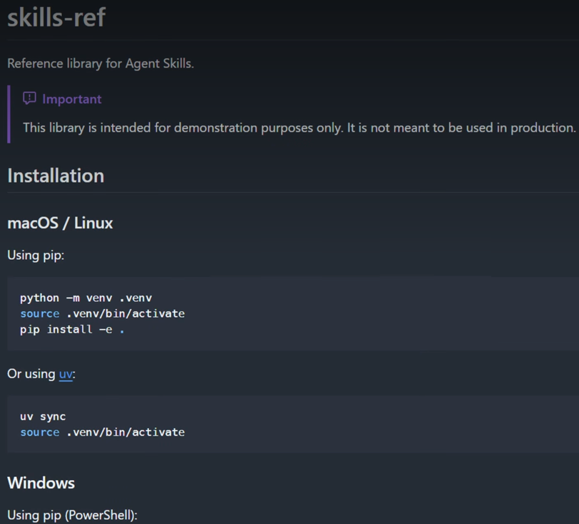
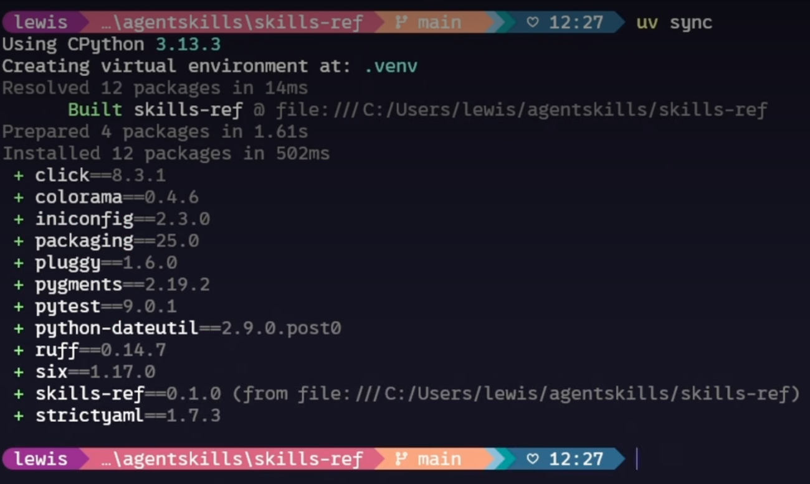
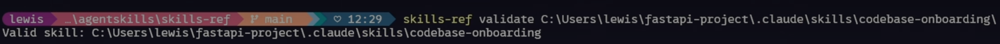

# Troubleshooting Skills

## What you'll learn

- Use the skills validator to catch structural issues before debugging  
- Diagnose and fix common skill triggering and loading problems  
- Resolve skill priority conflicts between enterprise, personal, project, and plugin skills  
- Debug runtime errors including missing dependencies, permissions, and path issues  

---

# Troubleshooting Skills

When skills don't work as expected, the problem usually falls into a few predictable categories.

Lets walk through each one — from skills that don't trigger to priority conflicts to runtime failures — and gives you a systematic troubleshooting approach.

You'll also learn about the skills validator tool and how to use `claude --debug` to diagnose loading issues.

---

# Key Takeaways

- Start with the skills validator tool — it catches structural problems before you spend time debugging other things  
- If a skill doesn't trigger, the cause is almost always the description — add trigger phrases that match how you actually phrase requests  
- If a skill doesn't load, check that `SKILL.md` is inside a named directory (not at the skills root) and the file name is exactly `SKILL.md`  
- If the wrong skill gets used, your descriptions are too similar — make them more distinct  
- For runtime errors, check dependencies, file permissions (`chmod +x`), and path separators (use forward slashes everywhere)  

---

When skills don't work, the problem usually falls into one of a few categories:

- The skill doesn't trigger  
- Doesn't load  
- Has conflicts  
- Fails at runtime  

The good news is that most fixes are pretty straightforward.

---

# Use the Skills Validator

The first thing to try is the agent skills verifier command.

Installation steps vary by operating system, but using `uv` is the easiest way to get it set up quickly.





Once installed:

- Navigate to your skill directory  
- Or run the command from anywhere  

The validator will catch structural problems before you spend time debugging other things.



---

# Skill Doesn't Trigger

Your skill exists and passes validation, but Claude isn't using it when you expect.

👉 The cause is almost always the **description**.

Claude uses semantic matching, so your request needs to overlap with the description's meaning.

If there's not enough overlap, no match.

---

## What to do

- Check your description against how you're actually phrasing requests  
- Add trigger phrases users would actually say  
- Test with variations like:  
  - "help me profile this"  
  - "why is this slow?"  
  - "make this faster"  
- If any variation fails to trigger, add those keywords to your description  

---

# Skill Doesn't Load

If your skill doesn't appear when you ask Claude *"what skills are available,"* check these structural requirements:

- The `SKILL.md` file must be inside a named directory, not at the skills root  
- The file name must be exactly `SKILL.md` — all caps on "SKILL", lowercase "md"  

---

## Debug Tip

Run:

```bash
claude --debug
````

Look for messages mentioning your skill name.

Sometimes this alone will point you straight to the problem.

---

# Wrong Skill Gets Used

If Claude uses the wrong skill or seems confused between skills:

👉 Your descriptions are probably too similar.

Make them distinct.

Being as specific as possible doesn't just help Claude decide when to use your skill — it also prevents conflicts with other similar-sounding skills.

---

# Skill Priority Conflicts

If your personal skill is being ignored, an enterprise or higher-priority skill might have the same name.

---

## Example

If there's an enterprise `"code-review"` skill and you also have a personal `"code-review"` skill, the enterprise one wins every time.

---

## Your options

* Rename your skill to something more distinct (usually the easier path)
* Talk to your admin about the enterprise skill

---

# Plugin Skills Not Appearing

Installed a plugin but can't see its skills?

👉 Try:

* Clear the cache
* Restart Claude Code
* Reinstall the plugin

If skills still don't appear after that, the plugin structure might be wrong.

This is when the validator tool really earns its keep.

---

# Runtime Errors

The skill loads but fails during execution.

---

## Common causes

* Missing dependencies

  * If your skill uses external packages, they must be installed
  * Add dependency info to your skill description so Claude knows what's needed

* Permission issues

  * Scripts need execute permission
  * Run `chmod +x` on any scripts your skill references

* Path separators

  * Use forward slashes everywhere, even on Windows

---

# Quick Troubleshooting Checklist

* Not triggering? → Improve your description and add trigger phrases
* Not loading? → Check your path, file name, and YAML syntax
* Wrong skill used? → Make descriptions more distinct from each other
* Being shadowed? → Check the priority hierarchy and rename if needed
* Plugin skills missing? → Clear cache and reinstall
* Runtime failure? → Check dependencies, permissions, and paths

```

